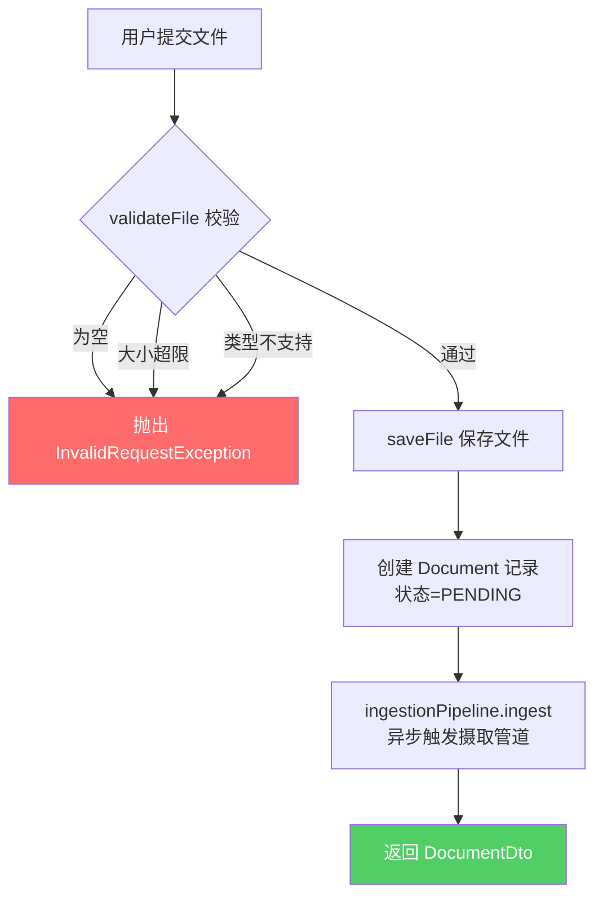
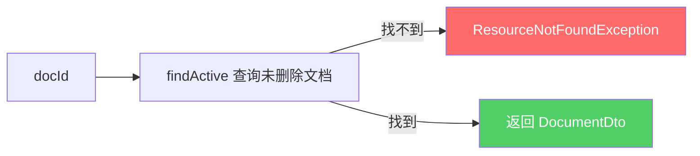
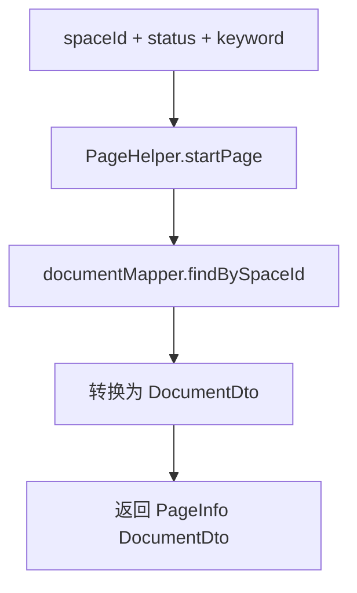
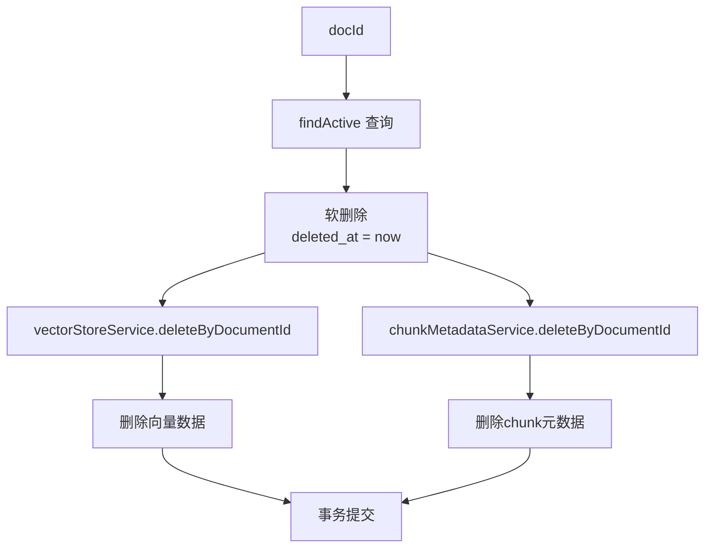
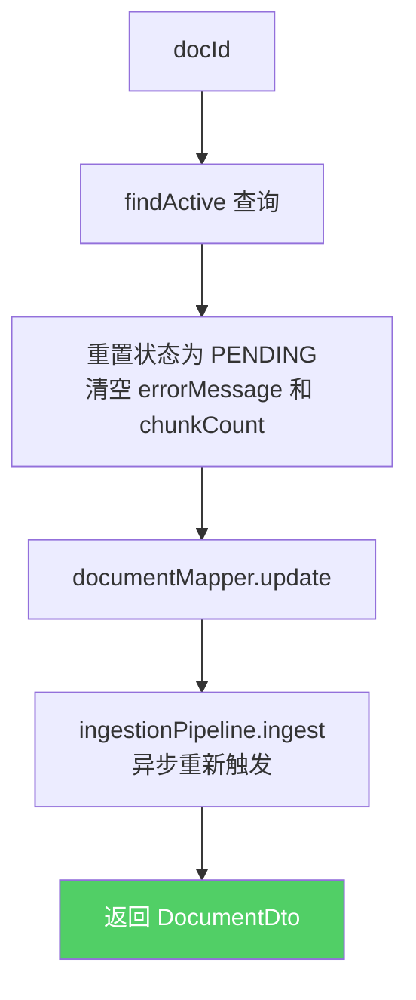
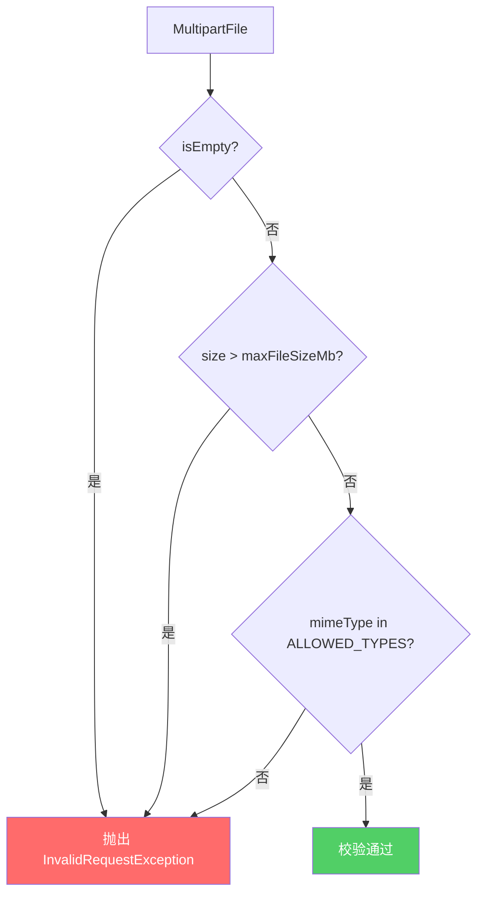

# DocumentServiceImpl 流程图

## uploadDocument 上传文档

```mermaid
flowchart TD
    A[用户提交文件] --> B{validateFile 校验}
    B -->|为空| E[抛出 InvalidRequestException]
    B -->|大小超限| E
    B -->|类型不支持| E
    B -->|通过| C[saveFile 保存文件]
    C --> D[创建 Document 记录<br/>状态=PENDING]
    D --> F[ingestionPipeline.ingest<br/>异步触发摄取管道]
    F --> G[返回 DocumentDto]

    style E fill:#ff6b6b,color:#fff
    style G fill:#51cf66,color:#fff
```

## getDocument 获取文档

```mermaid
flowchart LR
    A[docId] --> B[findActive 查询未删除文档]
    B -->|找不到| C[ResourceNotFoundException]
    B -->|找到| D[返回 DocumentDto]
    style C fill:#ff6b6b,color:#fff
    style D fill:#51cf66,color:#fff
```

## listDocuments 分页查询

```mermaid
flowchart TD
    A[spaceId + status + keyword] --> B[PageHelper.startPage]
    B --> C[documentMapper.findBySpaceId]
    C --> D[转换为 DocumentDto]
    D --> E[返回 PageInfo DocumentDto]
```

## deleteDocument 删除文档

```mermaid
flowchart TD
    A[docId] --> B[findActive 查询]
    B --> C[软删除<br/>deleted_at = now]
    C --> D[vectorStoreService.deleteByDocumentId]
    C --> E[chunkMetadataService.deleteByDocumentId]
    D --> F[删除向量数据]
    E --> G[删除chunk元数据]
    F --> H[事务提交]
    G --> H
```

## reprocessDocument 重新处理

```mermaid
flowchart TD
    A[docId] --> B[findActive 查询]
    B --> C[重置状态为 PENDING<br/>清空 errorMessage 和 chunkCount]
    C --> D[documentMapper.update]
    D --> E[ingestionPipeline.ingest<br/>异步重新触发]
    E --> F[返回 DocumentDto]
    style F fill:#51cf66,color:#fff
```

## validateFile 校验逻辑

```mermaid
flowchart TD
    A[MultipartFile] --> B{isEmpty?}
    B -->|是| C[抛出 InvalidRequestException]
    B -->|否| D{size > maxFileSizeMb?}
    D -->|是| C
    D -->|否| E{mimeType in ALLOWED_TYPES?}
    E -->|否| C
    E -->|是| F[校验通过]
    style C fill:#ff6b6b,color:#fff
    style F fill:#51cf66,color:#fff
```
