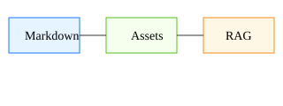
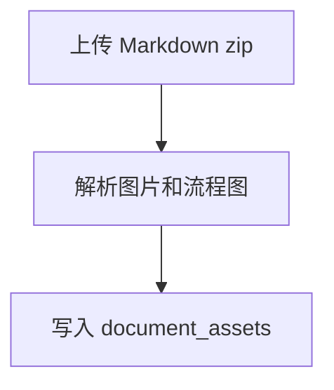
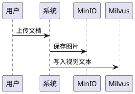

# L2 可视化 RAG 测试文档

## 图片章节

这里引用一张真实图片：

这里引用一张缺失图片：

## Mermaid 流程

```mermaid
flowchart TD
    A[上传 Markdown zip] --> B[解析图片和流程图]
    B --> C[写入 document_assets]
```

## PlantUML 流程

```plantuml
@startuml
用户 -> 系统: 上传文档
系统 -> MinIO: 保存图片
系统 -> Milvus: 写入视觉文本
@enduml
```
