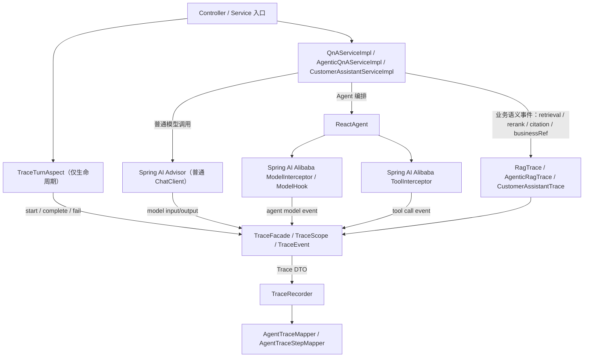

# ADR-010：Trace 接入解耦与 Spring AI Alibaba 原生采集重构

**状态**：已接受（已实施）

## 背景

ADR-009 已经定义了 Agent Trace、Replay 与 Eval 的数据模型和第一版能力，但当前代码接入方式存在明显问题：RAG 主流程直接依赖 `TraceRecorder`、`TraceStartRequest`、`TraceStepRequest`、`TraceCompleteRequest`，并在业务方法里手写 `jsonOf(...)`、`traceMap(...)`、`stepIndex` 和异常记录。

典型问题集中在：

- `QnAServiceImpl` 的 query rewrite、HyDE、retrieval、rerank、model call 中穿插大量 trace DTO 构造。
- `AgenticQnAServiceImpl` 的工具调用逻辑里混入 trace JSON 组装、耗时统计和 step 状态判断。
- 客服、售后、投诉域也开始复制 `jsonOf(...)` / `traceMap(...)` / `recordStep(...)` helper。
- 业务代码需要知道 trace 表字段语义，例如 `stepType`、`agentName`、`businessRefType`。
- 以后新增采集字段会迫使多个业务 service 同步修改，违反“采集逻辑不主导业务代码”的边界。

当前实现虽然能采集数据，但耦合度过高，继续扩展会让 RAG 代码越来越难读、难测、难重构。

另外，项目已经引入 Spring AI Alibaba Agent Framework：

- `ReactAgent.builder()` 支持 `interceptors(...)`、`hooks(...)`、`observationRegistry(...)`。
- 框架提供 `ToolInterceptor`、`ModelInterceptor`、`AgentHook`、`ModelHook`。
- 当前代码已经使用 `HumanInTheLoopHook`，也使用了 Spring AI `MessageChatMemoryAdvisor` 和 HTTP `ClientHttpRequestInterceptor`。

因此，Trace 接入不应只在“业务代码显式埋点”和“Spring AOP”之间二选一。更合适的方案是：**优先使用 Spring AI / Spring AI Alibaba 原生拦截点采集框架内事件，再通过项目内 Trace Facade 统一落库；AOP 仅作为外层 turn 生命周期兜底。**

## 决策

引入一层 **Trace Instrumentation Facade**，把底层 trace 写入和业务链路解耦；同时把 Agent 内部模型调用、工具调用采集优先下沉到 Spring AI Alibaba 原生拦截器。

业务服务不再直接依赖 `TraceRecorder` 和 trace DTO，而只依赖少量“领域语义追踪器”：

- `RagTraceFactory`
- `RagTrace`
- `AgenticRagTrace`
- `CustomerAssistantTrace`
- `ToolTrace`
- `TraceScope`
- `TraceContext`

底层 `TraceRecorder`、`ObjectMapper`、payload 截断、敏感字段脱敏、stepIndex、duration、异常保护、JSON 序列化统一收敛到 `kb-search/.../trace` 或 `kb-search/.../observability` 包。

采集优先级如下：

| 优先级 | 机制 | 使用范围 | 结论 |
|--------|------|----------|------|
| 1 | Spring AI Alibaba `ToolInterceptor` | ReactAgent 工具调用 | 主方案 |
| 2 | Spring AI Alibaba `ModelInterceptor` / `ModelHook` | ReactAgent 模型调用与 Agent 状态 | 主方案 |
| 3 | Spring AI `Advisor` | 普通 `ChatClient` RAG | 主方案 |
| 4 | Trace Facade 领域语义事件 | 检索、rerank、引用、业务对象 ID | 必须保留 |
| 5 | Spring AOP | 应用服务入口 turn 生命周期 | 兜底，不采集内部 step |
| 6 | HTTP `ClientHttpRequestInterceptor` | provider HTTP 报文 | 暂不作为一期主方案 |

## 目标

### 必须达成

- RAG 业务代码中不再出现 `TraceStepRequest` / `TraceStartRequest` / `TraceCompleteRequest`。
- RAG 业务代码中不再出现 `jsonOf(...)` / `traceMap(...)`。
- RAG 业务代码只表达业务阶段：rewrite、HyDE、retrieval、rerank、citation 和业务对象引用。
- trace 写入失败继续不影响用户响应。
- 现有 `agent_traces` / `agent_trace_steps` 表结构不变。
- Replay / Eval API 不受影响。

### 暂不追求

- 不做 AOP 全自动采集 Agent 内部步骤。
- 不引入 OpenTelemetry / Jaeger / MQ。
- 不重写 RAG 主流程。
- 不改变现有问答、客服、售后、投诉的业务行为。
- 不做 provider HTTP 抓包级 replay。

## 设计

### 1. 总体分层边界



业务代码只看上半部分，底层 DTO 和 Mapper 只在下半部分出现。

核心边界：

- `TraceRecorder` 是持久化适配器，不直接暴露给 RAG、客服、售后、投诉业务代码。
- Spring AI Alibaba 拦截器只负责框架内模型/工具事件，不负责表达业务语义。
- `RagTrace` / `CustomerAssistantTrace` 负责补充框架拿不到的业务字段，例如检索候选、rerank topK、citations、`businessRefId`。
- AOP 只包 service 入口生命周期，不能用来替代 `ToolInterceptor` / `ModelInterceptor`。

### 2. 为什么不把 AOP 作为主方案

AOP 的优势是接入成本低，适合 turn 级生命周期：

- 用户进入一次 `ask(...)` 或 `chat(...)` 时自动创建 trace。
- 正常返回时自动 complete。
- 抛异常时自动 fail。

但 AOP 不适合 Agent 内部 step：

- ReactAgent 的工具调用发生在框架内部，AOP 只能拦业务方法，难以稳定拿到 `toolCallId`、`RunnableConfig.threadId`、checkpoint、模型生成的 arguments。
- 工具 lambda 里有业务闭包和副作用逻辑，AOP 很难区分“模型决定调用工具”和“业务方法内部普通调用”。
- AOP 采集不到 Spring AI Advisor 链路中的 prompt/message 变化。
- AOP 容易变成隐式黑盒，后续维护者难判断某个 step 为什么被记录。

因此采用：**AOP 管入口，框架拦截器管 Agent 内部，领域 Trace 管业务语义。**

### 3. Spring AI Alibaba 原生拦截器设计

#### `TraceToolInterceptor`

用于 ReactAgent 工具调用采集。实现 Spring AI Alibaba `ToolInterceptor`。

采集字段：

| 来源 | 字段 |
|------|------|
| `ToolCallRequest` | `toolName`、`arguments`、`toolCallId`、`context` |
| `ToolCallExecutionContext` | `threadId`、`checkpointId`、graph state 摘要 |
| `ToolCallResponse` | `result`、`status`、`metadata` |
| 拦截器自身 | `durationMs`、异常类型、异常信息 |
| `TraceContext` | `traceId`、`agentName`、space/session/user |

伪代码：

```java
public final class TraceToolInterceptor extends ToolInterceptor {
    @Override
    public ToolCallResponse interceptToolCall(ToolCallRequest request, ToolCallHandler handler) {
        TraceContext context = TraceContextHolder.currentOrNoop();
        Instant startedAt = Instant.now();
        try {
            ToolCallResponse response = handler.call(request);
            traceFacade.recordEvent(context, TraceEvent.toolCallSucceeded(
                    request.getToolName(),
                    request.getToolCallId(),
                    request.getArguments(),
                    response.getResult(),
                    elapsedMs(startedAt)));
            return response;
        } catch (RuntimeException e) {
            traceFacade.recordEvent(context, TraceEvent.toolCallFailed(
                    request.getToolName(),
                    request.getToolCallId(),
                    request.getArguments(),
                    e,
                    elapsedMs(startedAt)));
            throw e;
        }
    }
}
```

注意：`ToolInterceptor` 负责记录“工具被调用过、入参是什么、结果是什么”。如果工具调用创建了业务对象，例如售后审核单、投诉单、投诉计划，仍由领域 trace API 补充 `businessRefType` / `businessRefId`，或者由工具返回 metadata 后被 interceptor 写入。

#### `TraceModelInterceptor`

用于 ReactAgent 模型调用采集。实现 Spring AI Alibaba `ModelInterceptor` 或 `ModelHook`。

采集字段：

- Agent name。
- threadId / checkpointId。
- 模型输入消息摘要或完整消息，受 `enterprise.kb.trace.include-history`、`include-prompts` 控制。
- 模型输出文本。
- 是否包含 tool calls。
- 错误和耗时。

设计原则：

- 可稳定拿到模型调用上下文时，用 `ModelInterceptor`。
- 只需要 before/after agent state 时，用 `ModelHook`。
- 不在模型拦截器里解析业务域，不写死 RAG、售后、投诉逻辑。

#### `TraceReactAgentFactory`

所有业务代码构建 `ReactAgent` 时不再直接散落 `.interceptors(...)`。

建议新增轻量工厂：

```java
public interface TraceReactAgentFactory {
    ReactAgent.Builder builder(String agentName, TraceContext traceContext);
}
```

或新增装饰器：

```java
public interface ReactAgentTraceCustomizer {
    ReactAgent.Builder customize(ReactAgent.Builder builder, String agentName, TraceContext traceContext);
}
```

业务目标形态：

```java
ReactAgent reactAgent = traceReactAgentFactory.builder("kb-search-agent", trace.context())
        .chatClient(chatClient)
        .systemPrompt(AgenticTokenBudgetService.AGENT_SYSTEM_PROMPT)
        .tools(searchTool)
        .compileConfig(CompileConfig.builder().recursionLimit(MAX_RECURSION_LIMIT).build())
        .build();
```

工厂内部统一添加：

- `TraceToolInterceptor`
- `TraceModelInterceptor`
- 既有业务 hook，例如 `HumanInTheLoopHook`
- `ObservationRegistry`（如果后续启用 Micrometer 指标）

这样可以避免每个业务类都记一次 `.interceptors(traceToolInterceptor, traceModelInterceptor)`。

### 4. Spring AI Advisor 设计

普通 RAG `QnAServiceImpl` 使用 `ChatClient`，不是 ReactAgent。这里优先使用 Spring AI Advisor 采集模型调用。

新增：

```java
public final class TraceChatClientAdvisor implements CallAroundAdvisor {
    // aroundCall 记录请求 messages / options / advisor context / response / duration / error
}
```

目标：

- 替代 `QnAServiceImpl` 中手写的 `MODEL_CALL` step。
- 与现有 `MessageChatMemoryAdvisor` 并存。
- Advisor order 要明确，建议 trace advisor 位于 memory advisor 之后，记录最终送入模型的上下文。

普通 RAG 的 retrieval、rerank、citation 仍由 `RagTrace` 记录，因为 Spring AI Advisor 不知道业务检索候选和最终引用。

### 5. 新增核心接口

#### `TraceScope`

表示一次 turn 级 trace 生命周期。

```java
public interface TraceScope extends AutoCloseable {
    UUID traceId();
    boolean enabled();
    TraceContext context();
    void event(TraceEvent event);
    void complete(Object output, Integer tokensUsed);
    void fail(Throwable error);
    @Override void close();
}
```

设计约束：

- `TraceScope` 内部持有 `traceId`、开始时间、step 序号。
- `event(...)` 接收结构化对象，不要求业务提前转 JSON。
- `complete(...)` / `fail(...)` 幂等，避免业务异常路径重复写。
- `close()` 可兜底处理未 complete 的 trace。

#### `TraceContext`

表示可传递到 Spring AI Alibaba 拦截器和领域 trace 的运行上下文。

```java
public record TraceContext(
        UUID traceId,
        String traceType,
        String agentName,
        UUID sessionId,
        UUID spaceId,
        UUID userId,
        boolean enabled
) {
    public static TraceContext noop() { ... }
}
```

设计约束：

- 不使用裸 `ThreadLocal<UUID>` 传 traceId。
- 如果框架回调只能通过线程上下文传递，则使用 `TraceContextHolder`，存放完整 `TraceContext`，并在 `try/finally` 中清理。
- 能显式传参的场景优先显式传 `TraceContext` 或领域 trace 对象。

#### `TraceEvent`

统一 step 表达。

```java
public record TraceEvent(
        String stepType,
        String name,
        String status,
        Object input,
        Object output,
        String toolCallId,
        String businessRefType,
        UUID businessRefId,
        Long durationMs,
        Throwable error
) {}
```

业务只传对象，序列化和脱敏由 facade 处理。

#### `RagTrace`

普通 RAG 专用语义接口。

```java
public interface RagTrace {
    void queryRewrite(String question, String rewrittenQuery);
    void hyde(String retrievalQuery, String hypotheticalDocument);
    void retrieval(String query, int recallSize, List<SearchHit> candidates);
    void rerank(String question, int topK, List<SearchHit> candidates, List<SearchHit> hits);
    void complete(String answer, List<Citation> citations, String modelUsed, int tokensUsed);
    void fail(Throwable error);
}
```

`QnAServiceImpl` 只调用这些方法，不再知道 `TraceStepRequest`。普通模型调用由 `TraceChatClientAdvisor` 记录，因此 `RagTrace` 不再暴露 `modelCall(...)`，避免业务代码继续承担模型 step 组装职责。

#### `AgenticRagTrace`

Agentic RAG 专用语义接口。

```java
public interface AgenticRagTrace {
    void finalModelCall(String question, String answer, boolean hasToolCalls);
    void complete(String answer, List<Citation> citations, String modelUsed);
    void fail(Throwable error);
    TraceContext context();
}
```

Agentic RAG 的工具调用主体由 Spring AI Alibaba `ToolInterceptor` 采集。`AgenticRagTrace` 只保留最终响应、引用和框架无法推断的业务字段。

#### `ToolTrace`

业务工具副作用补充 span。它不是替代 `ToolInterceptor`，而是用于补充业务对象引用。

```java
public interface ToolTrace extends AutoCloseable {
    void businessRef(String type, UUID id);
    void metadata(String key, Object value);
    @Override void close();
}
```

工具代码如需记录业务对象，写法变为：

```java
try (ToolTrace tool = trace.businessTool("escalateComplaint")) {
    ComplaintPlan plan = complaintWorkflowService.start(...);
    tool.businessRef("COMPLAINT_PLAN", plan.getId());
    return output;
}
```

### 6. RAG 代码目标形态

普通 RAG 目标形态：

```java
public QnAResponse ask(UUID spaceId, QnARequest req) {
    UUID sessionId = req.sessionId() != null ? req.sessionId() : UUID.randomUUID();
    RagTrace trace = ragTraceFactory.standard(spaceId, sessionId, req);
    try {
        String retrievalQuery = queryRewriteService.rewrite(req.question());
        trace.queryRewrite(req.question(), retrievalQuery);

        String hypotheticalDoc = hydeService.generateHypotheticalDocument(retrievalQuery);
        trace.hyde(retrievalQuery, hypotheticalDoc);

        List<SearchHit> candidates = ...
        trace.retrieval(retrievalQuery, recallSize, candidates);

        List<SearchHit> hits = rerankService.rerank(req.question(), candidates, req.topK());
        trace.rerank(req.question(), req.topK(), candidates, hits);

        ChatResponse chatResponse = ...

        QnAResponse response = ...
        trace.complete(answer, citations, modelUsed, tokensUsed);
        return response;
    } catch (RuntimeException e) {
        trace.fail(e);
        throw e;
    }
}
```

模型 step 由 `TraceChatClientAdvisor` 记录，因此普通 RAG 代码不再显式调用 `trace.modelCall(...)`。

Agentic RAG 目标形态：

```java
ReactAgent reactAgent = traceReactAgentFactory.builder("kb-search-agent", trace.context())
        .chatClient(chatClient)
        .systemPrompt(AgenticTokenBudgetService.AGENT_SYSTEM_PROMPT)
        .tools(searchTool)
        .compileConfig(...)
        .build();

private String executeSearch(String query, ..., AgenticRagTrace trace) {
    if (tooManyCalls) {
        return "已达到最大检索次数，请根据已有内容作答。";
    }

    List<SearchHit> candidates = ...
    List<SearchHit> reranked = ...
    trace.retrieval(query, TOOL_RECALL_SIZE, candidates, reranked);
    return formatHitsForLlm(...);
}
```

`searchKnowledgeBase` 的 tool input/output、成功/失败/耗时由 `TraceToolInterceptor` 记录；检索候选、rerank 结果、引用编号等业务语义由 `AgenticRagTrace` 补充。

### 7. HITL 与业务副作用设计

`HumanInTheLoopHook` 继续负责阻断 `submitAfterSalesReview` 这类需要人工审核的工具。Trace 侧只做记录，不改变 HITL 行为。

采集规则：

- `ToolInterceptor` 记录模型尝试调用的工具、参数和框架返回状态。
- `HumanInTheLoopHook` 触发中断时，额外写 `HITL_INTERRUPT` step。
- 审核单、投诉单、投诉计划等业务对象 ID 由领域 trace 补充。
- resume 时写 `RESUME` step，关联同一个 session/thread/checkpoint。

当前 `AfterSalesDomainHandler` 中的 `ThreadLocal<UUID> activeTraceId` 是临时技术债。重构后改为以下任一方式：

```java
DomainContext(..., TraceContext traceContext)
```

或：

```java
DomainContext(..., CustomerAssistantTrace trace)
```

禁止继续只传裸 `UUID traceId`。

### 8. Observation 与 HTTP Interceptor 边界

Spring AI / Spring AI Alibaba 的 Observation 能补充运行时指标，但不能替代 replay 数据。

| 能力 | 适合做什么 | 不适合做什么 |
|------|------------|--------------|
| `ObservationRegistry` | latency、error、模型/工具调用 metrics | 离线复现 payload |
| `ClientHttpRequestInterceptor` | provider 适配问题排查 | 一期默认采集 raw HTTP body |
| Trace DB | replay、eval、后台审计 | 高基数 metrics 聚合 |

第一版继续坚持 ADR-009 的边界：记录应用层可稳定获得的 prompt/message/tool/retrieval 数据，不做 provider HTTP 抓包级复现。

### 9. 包结构建议

```text
kb-search/src/main/java/com/enterprise/kb/search/trace/
├── TraceContext.java
├── TraceContextHolder.java
├── TraceScope.java
├── TraceEvent.java
├── TraceFacade.java
├── ToolTrace.java
├── NoopTraceScope.java
├── NoopToolTrace.java
├── agent/
│   ├── TraceReactAgentFactory.java
│   ├── TraceToolInterceptor.java
│   └── TraceModelInterceptor.java
├── advisor/
│   └── TraceChatClientAdvisor.java
├── impl/
│   ├── TraceFacadeImpl.java
│   ├── DefaultTraceScope.java
│   └── DefaultToolTrace.java
└── rag/
    ├── RagTrace.java
    ├── AgenticRagTrace.java
    ├── RagTraceFactory.java
    └── impl/
        ├── RagTraceFactoryImpl.java
        ├── StandardRagTrace.java
        └── AgenticRagTraceImpl.java
```

第一版也可以先放在 `service/trace`，但建议单独 `trace` 包，避免再和业务 service 混在一起。

### 10. 底层职责收敛

`TraceFacadeImpl` 负责：

- 调用 `TraceRecorder.startTrace(...)`。
- 维护 `TraceScope` 生命周期。
- step 序号自增。
- `ObjectMapper` 序列化。
- null-safe map/object 序列化。
- payload 截断。
- 写入失败保护。
- duration 统计。
- error type/message 提取。

业务服务不得再自建这些 helper：

- `jsonOf(...)`
- `traceMap(...)`
- `elapsedMs(...)`
- `recordSearchStep(...)`
- `recordToolStep(...)`

## 重构步骤

### Step 1：新增 Trace Facade 与上下文，不改业务行为

- 新增 `trace` 包接口与实现。
- 保留现有 `TraceRecorderImpl` 不动。
- `TraceFacadeImpl` 内部复用 `TraceRecorder`。
- 添加单测覆盖：
  - disabled trace 返回 noop scope。
  - event 自动递增 stepIndex。
  - event input/output 自动 JSON 序列化。
  - fail/complete 幂等。

### Step 2：接入 Spring AI Alibaba Agent 拦截器

- 新增 `TraceToolInterceptor`。
- 新增 `TraceModelInterceptor` 或 `TraceModelHook`。
- 新增 `TraceReactAgentFactory`，统一给 ReactAgent builder 注入 trace 拦截器。
- 先在 `AgenticQnAServiceImpl` 一个点试点，确认 tool input/output、toolCallId、threadId 能落库。

验收：

- `AgenticQnAServiceImpl` 的 `searchKnowledgeBase` 工具不再手写 `recordStep(...)`。
- ReactAgent 工具成功、失败、跳过仍能写 `TOOL_CALL` step。
- HITL 现有测试不受影响。

### Step 3：接入普通 ChatClient Advisor

- 新增 `TraceChatClientAdvisor`。
- `QnAServiceImpl` 调用 ChatClient 时添加 trace advisor。
- 保留 `MessageChatMemoryAdvisor`，确认 advisor 顺序。

验收：

- `QnAServiceImpl` 不再手写 `MODEL_CALL` step。
- 普通 RAG 仍能记录模型输入输出。

### Step 4：重构普通 RAG

目标文件：

- `QnAServiceImpl`

删除内容：

- `TraceRecorder` 依赖。
- `ObjectMapper` 依赖。
- `Trace*Request` imports。
- `jsonOf(...)`。
- `traceMap(...)`。
- `elapsedMs(...)`。

新增内容：

- `RagTraceFactory` 依赖。
- `RagTrace trace = ragTraceFactory.standard(spaceId, sessionId, req);`
- 在业务阶段调用 `trace.queryRewrite(...)` 等语义方法。
- 模型 step 交给 `TraceChatClientAdvisor`。

验收：

- `QnAServiceImpl` 中 `rg "TraceStepRequest|TraceStartRequest|TraceCompleteRequest|jsonOf|traceMap|TraceRecorder"` 为 0。
- `mvn test -pl kb-search -am` 通过。

### Step 5：重构 Agentic RAG

目标文件：

- `AgenticQnAServiceImpl`

删除内容：

- 直接 `TraceRecorder` 调用。
- `recordSearchStep(...)`。
- `messageSnapshots(...)` 如无业务意义则下沉。
- 手写 stepIndex。
- 工具 lambda 内的 trace JSON 组装。

新增内容：

- `AgenticRagTrace trace = ragTraceFactory.agentic(spaceId, sessionId, req, rawHistory, trimmedHistory, budget);`
- `TraceReactAgentFactory.builder("kb-search-agent", trace.context())` 构建 Agent。
- `executeSearch(..., trace)` 只补充 retrieval/rerank/citation 业务语义。

验收：

- `AgenticQnAServiceImpl` 中不出现 trace DTO。
- 工具调用成功、跳过、失败仍能写 `TOOL_CALL` step。
- `mvn test -pl kb-search -am` 通过。

### Step 6：处理客服/售后/投诉

已完成。目标不是一次性抽象所有业务域，而是复用同一套 ReactAgent 拦截器和业务 trace 补充能力：

- `CustomerAssistantTrace`
- `ToolTrace`
- `TraceContext` 或显式参数传递
- `TraceReactAgentFactory`

售后域已不再使用 `ThreadLocal<UUID>` 传 traceId。当前实现通过 `TraceContextHolder` 绑定外层 AOP 创建的 `TraceScope`，并由领域事件补充 HITL / 业务引用语义。

### Step 7：删除兼容性技术债

已完成主要业务路径清理：

- 业务入口由 `@TraceTurn` / `TraceTurnAspect` 管理 start、bind、complete、fail。
- `QnAServiceImpl`、`AgenticQnAServiceImpl`、`CustomerAssistantServiceImpl` 不再手写 `traceFacade.start(...)`、`trace.complete(...)`、`trace.fail(...)`。
- 普通 RAG、Agentic RAG、客服、售后、投诉域已移除重复 `jsonOf(...)` / `traceMap(...)`。
- 兼容构造器使用 `NoopTraceFacade`，业务类不再直接构造 `TraceFacadeImpl` / `NoopTraceRecorder`。

## 关键约束

### 不允许

- RAG service 直接 new `TraceStepRequest`。
- RAG service 直接调用 `ObjectMapper.writeValueAsString(...)` 只为 trace。
- RAG service 维护 stepIndex。
- RAG service 捕获 trace 写入异常。
- RAG service 出现 `businessRefType` 这类存储字段。
- 业务类各自手写 `.interceptors(traceToolInterceptor, traceModelInterceptor)`。
- 用 HTTP request interceptor 默认采集 provider 原始 body。

### 允许

- RAG service 调用领域语义方法，如 `trace.rerank(...)`。
- RAG service 把已有业务对象传给 trace facade。
- ReactAgent 构建统一走 `TraceReactAgentFactory` 或 `ReactAgentTraceCustomizer`。
- 工具代码用 `ToolTrace` 只补充业务引用和业务 metadata。

## 测试策略

### 单元测试

- `TraceFacadeImplTest`
  - noop scope。
  - complete/fail 幂等。
  - event 自动 stepIndex。
  - event 序列化失败不抛给业务。

- `StandardRagTraceTest`
  - query rewrite event 映射为 `QUERY_REWRITE`。
  - retrieval event 映射为 `RETRIEVAL`。
  - complete 映射为 trace output。

- `AgenticRagTraceTest`
  - retrieval/rerank 业务事件映射为 `RETRIEVAL` / `RERANK`。
  - complete 映射为 trace output。

- `TraceToolInterceptorTest`
  - 成功工具调用写 `TOOL_CALL/SUCCEEDED`。
  - 工具异常写 `TOOL_CALL/FAILED` 并继续抛原异常。
  - request 中的 `toolCallId`、arguments、threadId 被保留。

- `TraceChatClientAdvisorTest`
  - advisor 记录最终模型输入输出。
  - 与 `MessageChatMemoryAdvisor` 组合时顺序符合预期。

### 架构守护测试

新增轻量 ArchUnit 或普通文本扫描测试：

```text
QnAServiceImpl 禁止 import com.enterprise.kb.search.dto.Trace*
AgenticQnAServiceImpl 禁止 import com.enterprise.kb.search.dto.Trace*
QnAServiceImpl 禁止出现 jsonOf(
AgenticQnAServiceImpl 禁止出现 traceMap(
业务类禁止直接 new TraceStepRequest
业务类禁止直接注入 TraceRecorder（trace 包实现除外）
```

如果暂不引入 ArchUnit，可先用 JUnit 读取源码文本做守护。

## 迁移风险

| 风险 | 应对 |
|------|------|
| 抽象过度，反而看不懂 | 只抽 `RagTrace` / `ToolTrace`，不做通用万能 builder |
| trace 字段遗漏 | 先用现有验收报告场景回归，确认 replay JSON 字段仍在 |
| stepIndex 顺序变化 | 接受语义顺序不变即可，不依赖硬编码数字 |
| 测试构造器受影响 | 新接口注入后更新单测 fixture，不再用生产兼容构造器兜底 |
| `ThreadLocal` 泄漏 | 在 Step 6 移除售后域 ThreadLocal，改显式 trace 对象传递 |
| Spring AI Alibaba 拦截器字段不够 | 只让拦截器采集框架字段，业务字段仍由领域 trace 补充 |
| Advisor 顺序导致记录不到最终 prompt | 写组合测试固定 advisor order |
| 拦截器异常影响主流程 | 所有 trace 写入失败在 facade 内吞掉并 WARN |

## 验收标准

- `QnAServiceImpl` 和 `AgenticQnAServiceImpl` 不直接依赖 trace DTO。
- 外层 turn 生命周期由 `TraceTurnAspect` 统一管理。
- ReactAgent 工具调用 trace 由 `TraceToolInterceptor` 统一生成。
- 普通 ChatClient 模型调用 trace 由 `TraceChatClientAdvisor` 统一生成。
- RAG 文件行数下降，trace helper 从业务类移除。
- 现有 trace/eval API 不破坏。
- `mvn test -pl kb-search -am` 通过。
- `mvn test -pl kb-app -am` 通过。
- 真实普通 RAG 和 Agentic RAG 请求仍生成 trace 与 steps。

## 结论

Trace 是横切观测能力，不应该成为 RAG 主流程的第二套业务逻辑。第一版为了快速闭环采用显式埋点是合理的，但接下来必须把“显式埋点”升级为“框架原生拦截 + 显式业务语义事件”：ReactAgent 内部模型/工具调用交给 Spring AI Alibaba `ModelInterceptor` / `ToolInterceptor`，普通 ChatClient 模型调用交给 Spring AI Advisor，检索、rerank、citation、业务对象 ID 交给领域 trace。业务代码只表达检索、生成和业务动作，trace DTO、JSON、stepIndex、异常保护统一下沉到 tracing facade。
