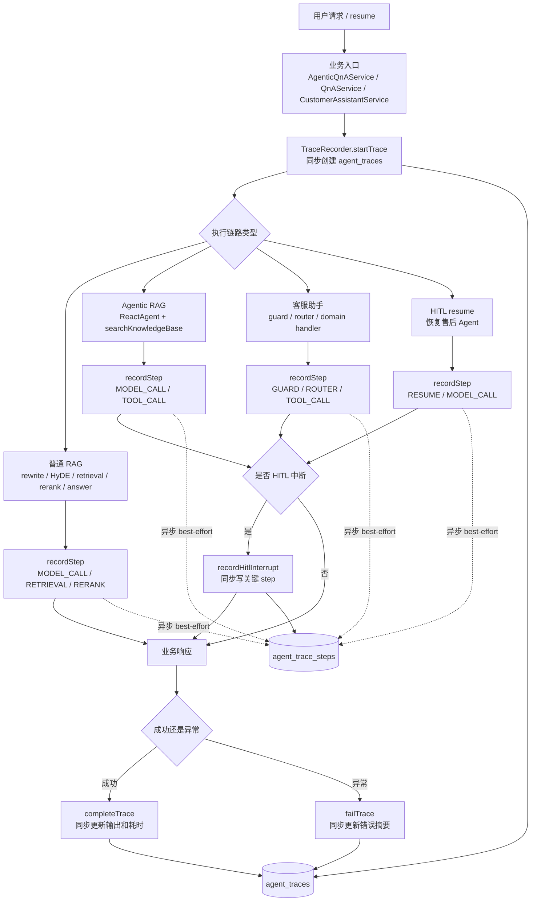
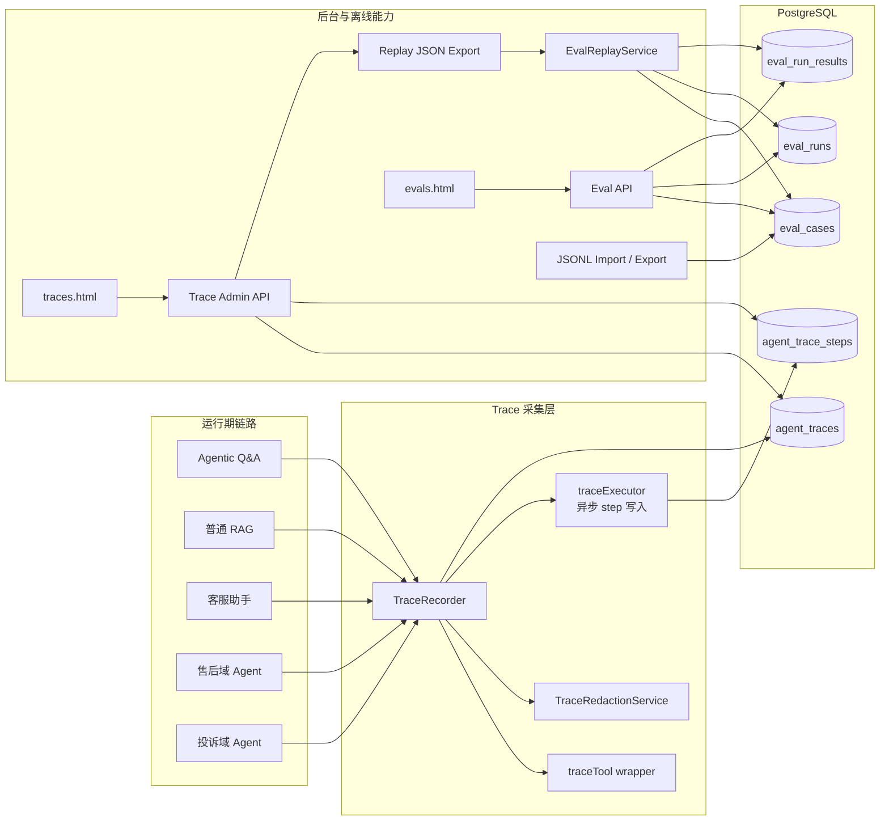
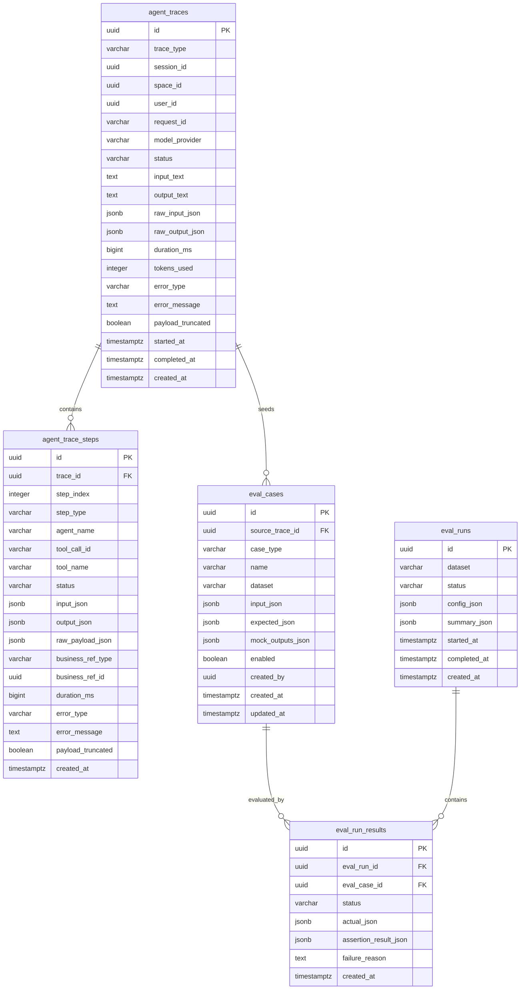
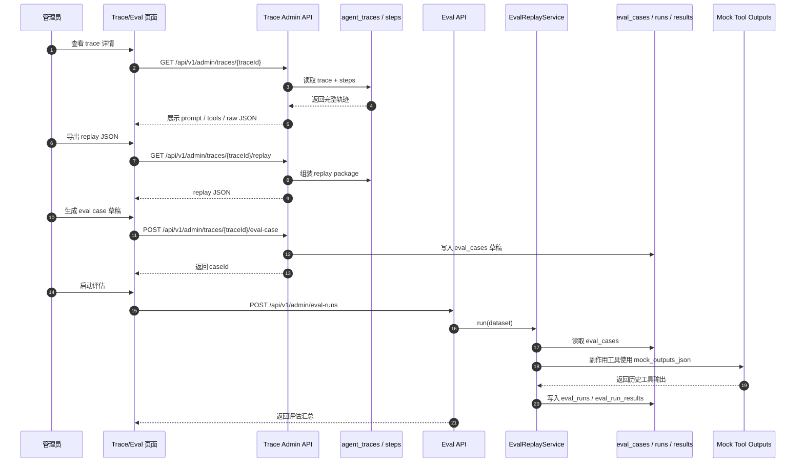

# 功能：Agent Trace、离线复现包与评估回放

## 概述

本功能为 Agentic RAG、商城客服助手、售后 HITL、投诉升级提供统一运行轨迹采集能力。目标是让一次线上对话可以被查清楚、导出、离线复现，并沉淀为评估用例。

架构决策见 [[decisions/adr-009-agent-trace-replay-eval]]。

## 成功标准

- 每次 Agentic QA / 客服助手对话至少生成一条 `agent_traces`。
- 每次工具调用都有 step 记录，包含工具名、入参、出参、异常、耗时。
- HITL 中断能在 trace 详情中看到 tool_call_id、工具参数、review request 关联。
- 能按 traceId 导出 replay JSON。
- 能从 trace 生成 eval case 草稿，并支持 JSONL 导入/导出。
- 能跑三类评估：路由/工具选择、检索质量、答案质量。
- trace 后台只允许管理员访问。

## 数据流



## 设计图

### 总体架构



### 数据模型



### 复现与评估回放



## 第一版接入点

| 链路 | 文件 | 接入内容 |
|------|------|----------|
| Agentic RAG | `AgenticQnAServiceImpl` | trace 外壳、system prompt/history/user、`searchKnowledgeBase` 工具、检索/rerank/citations、最终答案 |
| 普通 RAG | `QnAServiceImpl` | query rewrite、HyDE、hybrid search candidates、rerank topK、prompt、答案、token usage |
| 客服旧单体路径 | `CustomerAssistantServiceImpl.legacyChat()` | trace 外壳、影子路由、3 个工具、HITL 中断、最终答案 |
| 客服两层路由 | `CustomerAssistantServiceImpl.routedChat()` | guard、domain route、dispatch domain、最终答案、domain |
| 售后域 | `AfterSalesDomainHandler` | `checkAfterSalesEligibility`、`submitAfterSalesReview` HITL 中断、resume |
| 投诉域 | `ComplaintDomainHandler` | `escalateComplaint` 工具、complaintId、plan 启动结果 |
| 投诉执行器 | `ComplaintExecutorServiceImpl` | 后续阶段接入通知、赔付、结案等工具 |

## 模块设计

### DTO / Model

建议放在 `kb-search`：

- `model/AgentTrace.java`
- `model/AgentTraceStep.java`
- `model/EvalCase.java`
- `model/EvalRun.java`
- `model/EvalRunResult.java`
- `dto/TraceStartRequest.java`
- `dto/TraceStepRequest.java`
- `dto/TraceReplayPackage.java`
- `dto/EvalCaseDto.java`
- `dto/EvalRunDto.java`

### Service

| 服务 | 职责 |
|------|------|
| `TraceRecorder` | Agent 入口和工具回调使用的轻量记录器 |
| `AgentTraceService` | trace 查询、详情、导出 replay、生成 eval 草稿 |
| `EvalCaseService` | eval case CRUD、JSONL 导入导出 |
| `EvalReplayService` | 读取 eval case/replay package 并执行回放 |
| `TraceRedactionService` | 后台展示和导出时遮挡敏感 key |

`TraceRecorder` 应足够轻，不在业务路径里做复杂查询。复杂导出和评估放到 `AgentTraceService` / `EvalReplayService`。

### Mapper

MyBatis XML：

- `AgentTraceMapper.xml`
- `AgentTraceStepMapper.xml`
- `EvalCaseMapper.xml`
- `EvalRunMapper.xml`
- `EvalRunResultMapper.xml`

所有查询默认按 `deleted_at IS NULL` 或 status/时间范围过滤；trace 第一版可不做软删除，依靠保留周期清理。

## API 草案

后台 API 建议放在 `/api/v1/admin/traces` 和 `/api/v1/admin/evals`。

### Trace

| 方法 | 路径 | 说明 |
|------|------|------|
| `GET` | `/api/v1/admin/traces` | trace 列表，支持时间、类型、sessionId、spaceId、status、tool、error 过滤 |
| `GET` | `/api/v1/admin/traces/{traceId}` | trace 详情，含 steps |
| `GET` | `/api/v1/admin/traces/{traceId}/replay` | 导出 replay JSON |
| `POST` | `/api/v1/admin/traces/{traceId}/eval-case` | 从 trace 生成 eval case 草稿 |
| `DELETE` | `/api/v1/admin/traces/{traceId}` | 可选：删除单条 trace |

权限：`ROLE_SYSTEM_ADMIN` 或空间 `ADMIN`。空间 `ADMIN` 只能查本空间数据；客服全局 trace 若 `spaceId` 为空，只允许系统管理员。

### Eval

| 方法 | 路径 | 说明 |
|------|------|------|
| `GET` | `/api/v1/admin/eval-cases` | eval case 列表 |
| `GET` | `/api/v1/admin/eval-cases/{id}` | eval case 详情 |
| `POST` | `/api/v1/admin/eval-cases` | 创建 eval case |
| `PUT` | `/api/v1/admin/eval-cases/{id}` | 更新 eval case |
| `POST` | `/api/v1/admin/eval-cases/import-jsonl` | 导入 JSONL |
| `GET` | `/api/v1/admin/eval-cases/export-jsonl` | 导出 JSONL |
| `POST` | `/api/v1/admin/eval-runs` | 启动一次评估 |
| `GET` | `/api/v1/admin/eval-runs/{id}` | 查看评估汇总和逐 case 结果 |

## Replay JSON 草案

```json
{
  "traceId": "uuid",
  "traceType": "AGENTIC_QA",
  "sessionId": "uuid",
  "spaceId": "uuid",
  "userId": "uuid",
  "modelProvider": "DASHSCOPE",
  "input": {
    "message": "用户问题",
    "history": [],
    "systemPrompt": "..."
  },
  "tools": [
    {
      "name": "searchKnowledgeBase",
      "description": "...",
      "inputSchema": "KnowledgeSearchInput"
    }
  ],
  "steps": [
    {
      "index": 1,
      "type": "TOOL_CALL",
      "toolName": "searchKnowledgeBase",
      "input": {"query": "退款规则"},
      "output": {"text": "...", "hits": []},
      "durationMs": 123
    }
  ],
  "finalOutput": {
    "answer": "...",
    "citations": []
  }
}
```

## Eval Case JSONL 草案

每行一个 case：

```json
{"id":"case-001","caseType":"ROUTING_TOOL","dataset":"smoke","input":{"message":"我要投诉商家一直不处理退款","history":[]},"expected":{"domain":"COMPLAINT","requiredTools":["escalateComplaint"],"forbiddenTools":["submitAfterSalesReview"]}}
```

检索质量 case：

```json
{"id":"case-002","caseType":"RETRIEVAL","dataset":"frozen","input":{"message":"退货超过7天还能申请吗","spaceId":"..."},"expected":{"requiredDocumentIds":["..."],"requiredChunkIds":["..."],"minRecallAtK":1}}
```

答案质量 case：

```json
{"id":"case-003","caseType":"ANSWER","dataset":"frozen","input":{"message":"没有订单号可以退款吗","history":[]},"expected":{"mustContain":["订单号"],"mustNotContain":["已退款"],"groundedOnly":true}}
```

## 后台页面

新增静态页面：

- `kb-app/src/main/resources/static/traces.html`
- `kb-app/src/main/resources/static/evals.html`

页面保持最小可用：

- 左侧过滤条件，右侧表格。
- trace 详情用 tabs 展示：Summary / Prompt / Steps / Raw JSON / Replay。
- eval case 详情允许直接编辑 JSON。
- eval run 展示汇总指标和失败列表。

不做复杂标注工作流；人工补标先编辑 JSON。

## 实施阶段

| 阶段 | 内容 | 验证 | 二期优化点 |
|------|------|------|------------|
| Phase 0 | 建表迁移、model/mapper/service 骨架、配置项 | Maven 编译通过，mapper 单测覆盖插入/查询 | raw payload 迁移到对象存储，PG 仅保留 URI/hash/size |
| Phase 1 | `TraceRecorder` + Agentic RAG / 普通 RAG 接入 | 本地请求生成 trace，能看到检索/rerank/答案 | 抽象统一 tool wrapper，减少各 Agent 手工埋点重复 |
| Phase 2 | 客服助手、售后域、投诉域工具接入 | HITL 中断和投诉升级 trace 可查 | 覆盖投诉执行器、后续新增业务域和更多副作用工具 |
| Phase 3 | Trace 查询 API + replay 导出 | 按 traceId 导出 JSON，可人工复现 | 支持 replay 包版本化、差异对比和批量导出 |
| Phase 4 | Eval case 表、JSONL 导入导出、从 trace 生成草稿 | JSONL round-trip 无损 | 增加标注工作流、审核状态、样本分层采样和去重 |
| Phase 5 | Eval replay harness + 三类门禁 | smoke set 可跑，失败输出明确原因 | 引入 LLM-as-judge、趋势报表、模型/提示词版本对比 |
| Phase 6 | 最小后台页面 | 管理员可查 trace、导出 replay、生成 eval case | 升级为完整观测控制台，支持聚合指标、失败聚类和权限细分 |

## 评估门禁建议

第一版先支持阈值配置，默认：

| 指标 | 默认阈值 |
|------|----------|
| 路由/工具选择 case 通过率 | `>= 0.97` |
| 禁止副作用工具误调用数 | `0` |
| 检索 required chunk/doc 命中率 | `>= 0.90` |
| 答案断言通过率 | `>= 0.95` |
| 幻觉/无证据回答数 | `0` |

CI 可用环境变量门控，类似现有 `INTENT_EVAL=true`：

- `AGENT_TRACE_EVAL=true`
- `AGENT_TRACE_EVAL_DATASET=smoke`

## 保留与清理

虽然第一版 FULL_RAW 全量落库，仍应准备定时清理：

- raw payload 默认保留 30 天。
- trace 结构化元数据默认保留 180 天。
- eval case / eval run 长期保留。

第一版可以先提供手动清理 API 或命令；后续再加 `@Scheduled` 清理任务。

## 风险与缓解

| 风险 | 缓解 |
|------|------|
| PostgreSQL 体积快速增长 | payload 上限、采样率、保留周期、后续对象存储迁移 |
| 敏感数据暴露 | 管理员权限、敏感 key 遮挡、导出审计 |
| 异步 step 丢失 | trace 外壳同步写；HITL 中断同步写 |
| 埋点遗漏 | 第一版覆盖核心 Agent/工具；新增工具必须通过 `TraceRecorder` helper |
| 真实重放造成副作用 | 第一版只 mock replay，不执行副作用工具 |

## 非目标

- 不做 OpenTelemetry/Jaeger 集成。
- 不做 OpenSearch 日志平台。
- 不做 provider HTTP 抓包级记录。
- 不做 token-by-token 流式记录。
- 不做复杂标注平台。
- 不做生产副作用真实重放。

## 相关页面

- [[decisions/adr-009-agent-trace-replay-eval]] — 架构决策。
- [[decisions/adr-008-intent-routing-two-tier]] — 路由评估依赖 trace 沉淀。
- [[features/intent-routing]] — 两层路由功能。
- [[features/hitl-after-sales]] — 售后 HITL。
- [[features/complaint-escalation]] — 投诉升级。
