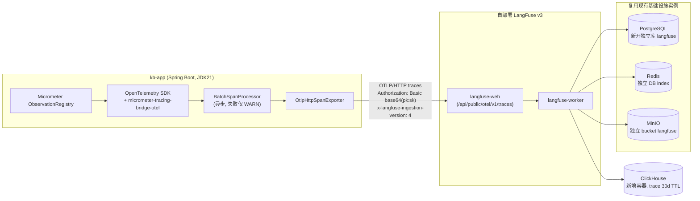
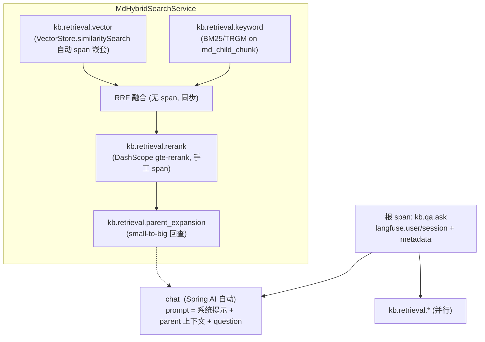
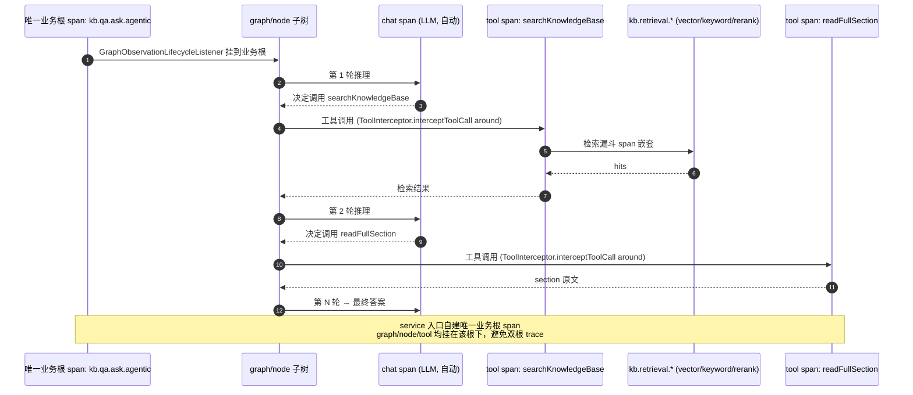
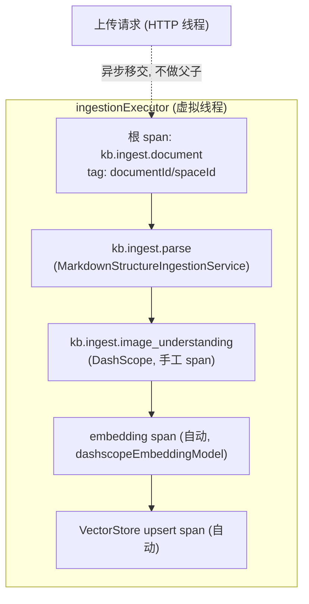
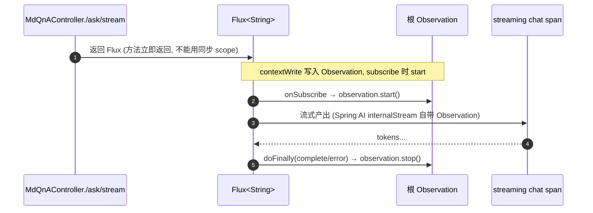
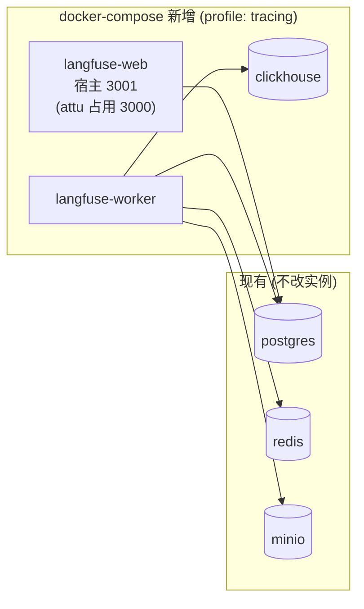

# LangFuse 在线 LLM Tracing

> 状态：代码已落地编译通过，运行态待起栈联调验收
> 设计文档：`docs/design-langfuse-tracing.md`
> 子设计：Input/Output 映射已并入本页（见 [[#Input/Output 映射（子设计）]]，**Phase 1 代码已落地、运行态待验收**）；基础设施 span 噪音过滤见 [[#基础设施 span 噪音过滤]]（代码已落地、单测 24/24、运行态待验收）
> 架构决策：[[decisions/adr-015-langfuse-tracing]]
> 前置评估侧 ADR：[[decisions/adr-014-ragas-integration]]（"备选方案"标记的 LangFuse 自部署即本方案）
> 已退役的前身：原 ADR-009 / ADR-010 自研 trace（迁移 032 退役，落库形态废弃）

## 目标

为 MD 问答竖井的在线请求路径与文档入库管线建立分布式 LLM tracing，把"一次请求 = 一棵 span 树"上报到自部署的 LangFuse，覆盖：

- 每次 LLM 调用的 prompt / completion / token / 延迟 / 模型 / provider
- ReactAgent 多步循环的 **业务根 span + graph/node 子 span + 每次 tool 调用 span**
- RAG 检索漏斗的 vector / keyword / rerank / parent-expansion 四段
- 文档入库的解析 / embedding / 图片理解 / 向量入库各环节

非目标（一期）：LangFuse Cloud、metrics 导出、复杂 DLP、Ragas 评估接入 LangFuse scores、任何形式的 trace 落业务库。

## 总体架构



代码侧只产 OTLP，后端是 endpoint 决策，保持厂商中立——与 [[decisions/adr-014-ragas-integration]] 评估侧的中立立场一致。**不重新引入**已随迁移 032 退役的 `TraceFacade` / advisor / 拦截器那套落库框架。

## 配置门禁

总开关 `enterprise.kb.tracing.enabled`（环境变量 `KB_TRACING_ENABLED`），**默认 false**。关闭时：

- `management.tracing.enabled=false` → Observation 不产 span，零开销
- 自定义 tracing bean（reactor 传播 hook / 脱敏 filter / 业务属性 SpanProcessor）经 `@ConditionalOnProperty` 不装配
- 导出器仅当 `OTEL_EXPORTER_OTLP_TRACES_ENDPOINT` 就绪时才装配（Spring Boot OTLP 自动配置）

LangFuse 未起或本地开发时应用照常启动。

## 现状盘点与四处埋点盲区

实现前必须补齐 ChatModel / VectorStore 上的 `ObservationRegistry` 注入，否则默认链路零 trace。

| # | 位置 | 问题 | 处理 |
|---|------|------|------|
| A | `AiModelConfig.llamaCppChatClient` | 手工 `OpenAiChatModel.builder()` **未注入 ObservationRegistry** → 落 NOOP；而 llama.cpp 是**默认 chat provider**，默认链路零 trace | 注入容器 `ObservationRegistry`，`OpenAiChatModel.builder()` 与 `ChatClient.builder()` 两处都带上 |
| B | `dashscopeChatClient` | DashScope 自动配置已注入 registry（jar 内自带 `DashScopeChatModelObservationConvention`） | 无需改动 |
| C | `spring-ai-alibaba-agent-framework` 1.1.2.2 | ReactAgent 默认不产 tool span，graph observation 若独立开根可能与 service 根形成双根 trace。jar 字节码核实有 `ToolInterceptor`/`ModelInterceptor` 与 graph-core `GraphObservationLifecycleListener` | service 入口自建唯一业务根 span；`GraphObservationLifecycleListener` 显式挂到该根下；`ToolInterceptor` 产 tool span（`.interceptors(...)`，零业务污染） |
| D | `AppConfig.mdVectorStore` | 手工建 `VectorStore` bean（Milvus 自动配置被 exclude），同 llama.cpp 一类坑 | 建 bean 时注入 `ObservationRegistry`，使 `VectorStore.similaritySearch` 自动产 span |

## Span 模型与命名

遵循 OTel **GenAI 语义约定**（Spring AI 默认 convention），叠加 LangFuse 业务上下文属性。

| span 类型 | 来源 | 命名 |
|-----------|------|------|
| 根 span | service / worker 入口自建 | `kb.qa.ask` / `kb.qa.ask.agentic` / `kb.qa.ask.stream` / `kb.ingest.document` |
| LLM span | Spring AI 自动 | `chat <model>` + `gen_ai.*` |
| Tool span | `ToolInterceptor` around | `gen_ai.tool.execution` + tool 名 / toolCallId / 入参摘要 |
| 检索 span | `MdHybridSearchService` 手工 | `kb.retrieval.vector` / `kb.retrieval.keyword` / `kb.retrieval.rerank` / `kb.retrieval.parent_expansion` |
| VectorStore span | Spring AI 自动（补 registry 后） | `db <op>` |
| Graph/Node span | `GraphObservationLifecycleListener` | graph-core 自带命名 |

**业务上下文属性**（trace attribute / metadata attribute）：

- `langfuse.user.id` / `langfuse.session.id`（高基数字段，不作为 low-cardinality tag）
- `langfuse.trace.metadata.space_id` / `langfuse.trace.metadata.model_provider`

属性先挂根 span，再通过本地 trace context + `SpanProcessor`（`LangfuseChildAttributeSpanProcessor`）在每个子 span `onStart` 复制上去。**走本地 thread-local，不经 baggage**，避免随下游 HTTP 请求外发给模型 provider。

## 单轮 MdQnA 的 span 树



`V` 与 `K` 经 `CompletableFuture.supplyAsync` 在 **ForkJoinPool** 并行——必须用 `ContextSnapshot.wrapExecutor` 包装的 executor 替换裸 `supplyAsync`，否则两段检索 span 脱离根 span 成孤儿 trace。

## Agentic 问答的 span 树



- **业务根**：`kb.qa.ask.agentic` 由 service 入口自建，是唯一 trace root
- **graph/node 子树**：经 `CompileConfig.builder().observationRegistry(...)` 装配 `GraphObservationLifecycleListener`，通过 `register(executionId, rootObservation)` 显式挂到业务根下；若 `executionId` 不可稳定获取，则自写轻量 `GraphLifecycleListener` 控制命名与父上下文
- **tool span**：`ToolInterceptor` around `ToolCallHandler.call(req)`，per-tool-call 粒度。`ToolCallRequest` 自带 `toolName` / `arguments` / `toolCallId` / `executionContext`（含 `state` / `threadId`），**业务工具体零侵入**——这比"在 lambda 体内手写 span"更干净，也比旧 `TraceToolInterceptor` 切入点更标准

## 文档入库的独立 trace



入库 trace 是**独立根 trace**（异步、生命周期超出上传请求），不挂在上传 HTTP 请求下；虚拟线程上同样需要上下文传播。

## 流式端点根 span 生命周期



理由：流式是前端默认路径，不 trace 等于最常用路径无数据。

## 跨线程上下文传播 ①+②+③

graph-core 内部为 reactive/异步生成器，classpath 上有 `DashScopeAsyncToolCallingManagerAutoConfiguration`，`MdHybridSearchService` 用 `CompletableFuture.supplyAsync`——纯 thread-local 根 Observation 会与子 span 脱节成孤儿 trace。组合方案：

| 机制 | 覆盖面 | 说明 |
|------|--------|------|
| ① reactor 自动传播 | graph 内部线程上的 LLM span | `TracingConfig` 在 enabled 时 `Hooks.enableAutomaticContextPropagation()` + `micrometer-context-propagation` + `ObservationThreadLocalAccessor`，一行开关 |
| ② `ContextSnapshot` 包装 | `CompletableFuture` 检索并行（vector/keyword） | `MdHybridSearchServiceImpl` 用 `ContextSnapshot.wrapExecutor` 包并行检索 executor，对自有并行代码确定性兜底，不依赖 reactor 是否传播 |
| ③ 关异步 tool manager | tool 执行线程 | `spring.ai.alibaba.tool.async.enabled=false`，tool 同步在调用线程跑，最大化 thread-local 直接命中 |

**验证顺序**：①②③ 必须同批完成后再验收。先用单轮问答验证 `kb.retrieval.vector` / `kb.retrieval.keyword` 挂在 `kb.qa.ask` 下，再用 agentic 问答验证 graph / LLM / tool / retrieval 都挂在 `kb.qa.ask.agentic` 这一棵树下。

## 正文捕获与脱敏

`spring.ai.chat.observations.log-prompt` / `log-completion` / `include-error-logging` 全开，但**进入 trace 的正文必须先经 MVP 级 `ObservationFilter` / `SpanProcessor` 脱敏 + 长度硬上限**；喂给模型的真实 prompt/completion 不受影响。

**MVP 脱敏规则**（`SensitiveDataObservationFilter` + `SensitiveDataRedactor`）：

- 至少覆盖 API Key / JWT / Bearer Token / password 字段 / email / 手机号等正则模式，替换为固定占位符
- prompt、completion、tool 参数、tool 返回、检索上下文分别设置字符数硬上限（`enterprise.kb.tracing.max-*-chars`），超出仅记录截断标记与原始长度

**风险边界**：自部署 + 区内 + 访问控制只能降低数据出境与第三方可见性风险，**不能替代脱敏**；LangFuse、ClickHouse 备份和运维账号仍可能看到 trace 内容。

**已落地**：tracer 在场时 Spring AI 把 prompt/completion 写成 span **event**，而 LangFuse 认 `gen_ai.*` / `langfuse.observation.input/output` **attribute**——曾担心导致详情页 input/output 为空。现已由 `ChatModelContentObservationFilter` 把自动 generation span 的 prompt/completion 映射到 `langfuse.observation.input/output` attribute（不再仅靠 event）；业务 span 则由 `TracingSupport` 直写。两路均编译通过、单测覆盖，**仅运行态待联调验收**。详见下文 §Input/Output 映射。

## Input/Output 映射（子设计）

> **Phase 1 代码已落地，运行态待起栈联调验收**（2026-06-04）。完整设计 `docs/langfuse-tracing.md` 第二部分；原独立页 `features/langfuse-io-mapping` 已并入本节。
> 落地实现：`ChatModelContentObservationFilter`（`kb-app`，把 Spring AI ChatModel prompt/completion 映射到 `langfuse.observation.input/output`，由 `TracingConfig` 装配，`ChatModelContentObservationFilterTest` 覆盖）+ 业务 span（`kb.qa.ask*` / `kb.retrieval.*` / `kb.ingest.*` / tool）经 `TracingSupport` 直写 input/output。
> 剩余只是验收标准中的运行态部分（LangFuse UI 可见 Input/Output、ClickHouse `observations.input/output` 不为 NULL、脱敏与截断实测），随整体起栈一并验。

**问题**：tracing 落地后 LangFuse 有 trace / generation 结构，但 ClickHouse `observations.input/output` 全 `NULL`——只知"调用发生"，看不到模型输入输出、检索上下文、工具参数、入库结果。根因是 Spring AI 自动 generation span 不把 prompt/completion 写进 LangFuse 可识别的 input/output 字段，需项目主动写入 LangFuse 原生 attribute。

**契约（D1）**：统一用 LangFuse 原生 namespace（不以 OpenInference 为主契约）——`langfuse.trace.input/output`、`langfuse.observation.input/output`、`langfuse.{trace,observation}.metadata.*`。

**两阶段**：

- **Phase 1（本次）**：补齐**项目自建业务 span** 的 input/output，由 `TracingSupport` 在 `Observation.stop()` 前直写，不依赖 Spring AI handler 顺序。
- **Phase 2（PoC 后定）**：评估给 Spring AI 自动 generation span（`chat *`）补 input/output——需 `ObservationHandler<ChatModelObservationContext>`、依赖 handler 执行顺序；不稳定就放弃、继续靠业务 span。

**关键决策**：

- **D2** 扩展 `TracingSupport.SpanBuilder` 为唯一写入入口（`traceInput`/`traceOutputFrom`/`input`/`outputFrom`/`metadata`）；`*OutputFrom` 在业务体返回后、stop 前执行，异常不写 output 但写错误 metadata。
- **D3** 官方 `log-prompt`/`log-completion`/`include-error-logging` 从联动 `KB_TRACING_ENABLED` 拆为独立开关、**默认全关**（官方开关只把正文打进应用日志、不进 LangFuse 也不过脱敏）；LangFuse input/output 由本设计负责。
- **D4** embedding span **不写** input/output（向量对人无价值、input 体量大风险高），验收明确允许为空。
- **D5** 检索 output 写**结构化摘要**（score / title / section / 截断脱敏后的 excerpt），不写完整 parent，受 `KB_TRACING_MAX_RETRIEVAL_CHARS` 控制。
- **D6** 入库写状态 / 统计：input = filename / documentId，output = `status=READY, chunks=N` 或 `FAILED, error=...`。

> [!key-insight] 写入收口在 TracingSupport
> 所有正文写入**必须**在 `TracingSupport` 方法内部调 `SensitiveDataRedactor.redactAndTruncate(...)`，调用方不能绕过脱敏直写 `langfuse.*.input/output` 高基数正文。这是脱敏唯一收口点，与上文 `SensitiveDataObservationFilter`（KeyValue 路径兜底，**不**覆盖 span event 与这些直写 attribute）互补。

**写入规格（Phase 1）**：`kb.qa.ask*` = 问题 / 答案；`kb.retrieval.*` = query / 命中摘要；`gen_ai.tool.execution` = 参数 / 结果；`kb.ingest.*` = filename / status / chunkCount；均带 userId / sessionId / spaceId 等 metadata。**改动**落 `TracingAttributes` / `TracingSupport`（kb-common）+ `MdQnAServiceImpl` / `MdAgenticQnAServiceImpl` / `MdHybridSearchServiceImpl` / `TracingToolInterceptor` / `MdDocumentIngestionWorkerImpl`。

## 基础设施 span 噪音过滤

> **代码已落地（编译通过、单测 24/24），运行态待起栈联调验收**（2026-06-04）。设计见 `docs/design-langfuse-noise-filter.md`（注：该设计文档当前尚未落到 `docs/`，仅代码与本节记录）。

**问题**：tracing 开启后 Spring Boot Micrometer Observation 会自动采集 HTTP / Security / Scheduler 等基础设施 observation，一并经 OTLP 上报。LangFuse 作为 LLM / RAG / 入库链路观测平台不需要这些噪音。典型噪音：投诉超时检查定时任务（每 60 秒一次，持续刷屏）、`security filterchain *`、`authorize request/method`、`secured request`、`/actuator/health` 健康检查。

**实现**：`ExcludedObservationNamePredicate`（`kb-app`）——按 observation name **大小写不敏感前缀**黑名单命中即降为 NOOP，未命中与未知 observation 默认放行（白名单式安全：避免误杀业务链路）。黑名单经 `TracingProperties.excludedObservationNamePrefixes` 配置，可由环境变量 `KB_TRACING_EXCLUDED_OBSERVATION_NAME_PREFIXES`（逗号分隔）**整体覆盖**——排查 Security/Scheduler 问题时清空即恢复基础设施 span 可见。

`application.yml` 默认黑名单：

```yaml
enterprise.kb.tracing.excluded-observation-name-prefixes:
  - "tasks.scheduled.execution"     # 定时任务（含投诉超时检查）
  - "security filterchain"
  - "authorize request"
  - "authorize method"
  - "secured request"
  - "http get /actuator/health"
  - "http.server.requests"
  - "spring.security"
  - "spring.ai"
```

> [!note] 默认黑名单与 todo 列举略有出入
> 实现采用 `tasks.scheduled.execution` 前缀（覆盖所有定时任务，不只投诉超时 `complaint-deadline-scheduler`），并额外屏蔽 `http.server.requests` / `spring.security` / `spring.ai` 前缀。业务链路（`kb.*` / `chat *` / `embedding *` / `gen_ai.*` / `md-documents/upload` / `md-qa`）不在黑名单内，默认放行。

**验收标准（运行态待验）**：投诉超时定时任务、`/actuator/health`、security filterchain / authorize span 不再进 LangFuse；Markdown 上传仍见 `md-documents/upload` / `kb.ingest.document` / `kb.ingest.parse`；问答仍见 `kb.qa.ask` / `kb.retrieval.*` / `chat *` / `embedding *`。

## 共享 tracing 工具（`kb-common`）

`com.enterprise.kb.common.tracing` 提供命令式助手与上下文管理：

| 组件 | 职责 |
|------|------|
| `TracingSupport` | 根/子 span 命令式助手，开关关闭时直接跑业务体（无 NPE / 性能损耗） |
| `TracingContextHolder` | 业务属性 thread-local + 注册到 context-propagation，供跨线程传播 |
| `TracingAttributes` | LangFuse 属性 key 常量 |
| `SensitiveDataRedactor` | MVP 正则脱敏 + 截断 |

## 基础设施增量



`docker compose --profile tracing up -d` 起这三个新容器。

- **PostgreSQL**：现有实例上 `CREATE DATABASE langfuse`（由 `postgres-init.sql` 建），独立 `DATABASE_URL`，LangFuse 迁移不碰应用 schema
- **Redis**：独立 DB index 或独立 key prefix
- **MinIO**：独立 bucket `langfuse`（**需预先创建**）
- **ClickHouse**：新容器，trace 数据 **30 天 TTL**（可配）
- **LangFuse 必需密钥**（`.env.example` 已列）：`LANGFUSE_SALT` / `LANGFUSE_ENCRYPTION_KEY` / `LANGFUSE_NEXTAUTH_SECRET` / `CLICKHOUSE_PASSWORD`——**禁止使用 compose 示例默认值**
- 应用容器仅在 `KB_TRACING_ENABLED=true` 时才连 OTLP

## 配置项 / 环境变量

```yaml
enterprise:
  kb:
    tracing:
      enabled: ${KB_TRACING_ENABLED:false}      # 总开关
spring:
  ai:
    chat:
      observations:
        log-prompt: ${KB_TRACING_ENABLED:false}
        log-completion: ${KB_TRACING_ENABLED:false}
        include-error-logging: ${KB_TRACING_ENABLED:false}
management:
  tracing:
    sampling:
      probability: ${KB_TRACING_SAMPLE_RATIO:1.0}     # Spring Boot 原生采样, MVP always-on
  otlp:
    tracing:
      endpoint: ${OTEL_EXPORTER_OTLP_TRACES_ENDPOINT:}   # http://langfuse-web:3000/api/public/otel/v1/traces
      headers:
        Authorization: Basic ${LANGFUSE_OTLP_BASIC_AUTH:}  # base64(pk:sk)
        x-langfuse-ingestion-version: "4"
```

`.env.example` 增量：`KB_TRACING_ENABLED` / `KB_TRACING_SAMPLE_RATIO` / `OTEL_EXPORTER_OTLP_TRACES_ENDPOINT` / `LANGFUSE_OTLP_BASIC_AUTH` / `LANGFUSE_PUBLIC_KEY` / `LANGFUSE_SECRET_KEY` / `LANGFUSE_DB_NAME` / `LANGFUSE_NEXTAUTH_URL` / `LANGFUSE_NEXTAUTH_SECRET` / `LANGFUSE_SALT` / `LANGFUSE_ENCRYPTION_KEY` / `CLICKHOUSE_*`。

> 通过 OTel Collector 转发可用通用 endpoint `http://langfuse-web:3000/api/public/otel`；本应用直接由 Spring Boot trace exporter 发送时使用 `/api/public/otel/v1/traces`。

## 关键决策速查

完整论证见 [[decisions/adr-015-langfuse-tracing]]。

| 编号 | 决策 |
|------|------|
| D1 | Micrometer Observation → OTLP → 后端可换；后端选 LangFuse |
| D2 | 自部署 LangFuse（沿用 [[decisions/adr-014-ragas-integration]] C1 否决 Cloud 的同一理由） |
| D3 | Agentic 满档：service 自建唯一业务根 span + graph/node 子 span + LLM span + tool span |
| D4 | 跨线程传播 ①+②+③；业务上下文用 LangFuse trace attributes/metadata，并传播到子 span |
| D5 | 正文进 trace 前做 MVP 级脱敏 + 长度硬上限；检索上下文软截断 |
| D6 | 检索做满：vector/keyword/rerank/parent-expansion 四段 span |
| D7 | 配置门禁默认关；always-on 采样（ratio 可配）；BatchSpanProcessor 失败仅 WARN；只导 trace 不导 metrics |
| D8 | 流式端点一期纳入，reactor 生命周期模式 |
| D9 | 一期与 Ragas 分开（推迟二期打通） |
| D10 | 复用现有 PG/Redis/MinIO 实例（PG 新开独立库），新增 ClickHouse；trace 30d TTL |
| D11 | 入库管线一期也 trace（独立根 trace） |

## 实施步骤建议顺序

1. 依赖：`micrometer-tracing-bridge-otel` + `opentelemetry-exporter-otlp` + `micrometer-context-propagation`
2. 补埋点盲区 A/D（llama.cpp `OpenAiChatModel` + `mdVectorStore` 注入 registry）
3. docker-compose 起 LangFuse 栈，建独立库 / bucket / index + ClickHouse TTL
4. 配置门禁 + OTLP exporter + BatchSpanProcessor（失败 WARN）+ `ObservationFilter`/`SpanProcessor` 脱敏截断
5. ① reactor 自动传播 + ② `ContextSnapshot` 包装 `MdHybridSearchService` 并行检索 + ③ 关异步 tool manager → 验证 LLM/retrieval span 挂树
6. service 入口根 span：单轮 / agentic / stream / ingest 都自建唯一业务根 span（设置 `langfuse.user.id` / `langfuse.session.id` / metadata）；流式用 reactor 生命周期
7. 业务上下文下传：用本地 trace context + `SpanProcessor` 将 LangFuse user/session/metadata attributes 复制到 LLM / tool / retrieval 子 span；验证不会把这些属性发给外部模型 API
8. graph 子树：`GraphObservationLifecycleListener` 挂 `CompileConfig`，并显式 register 到 agentic 业务根；若不可控则改用自写 `GraphLifecycleListener`
9. tool span：注册 `TracingToolInterceptor`（`ReactAgent.builder().interceptors(...)`）；检索漏斗四段 span 挂在 tool / service 业务根下
10. 入库 worker 独立根 trace + 图片理解手工 span
11. 验证正文是否落到 LangFuse input/output；必要时加自定义 `SpanProcessor`
12. 更新 CLAUDE.md tracing 章节

## 待验证风险

- `ChatModelContentObservationFilter` 把自动 generation span 的 prompt/completion 映射到 `langfuse.observation.input/output` 后，LangFuse UI / ClickHouse 是否实际可见（event vs attribute 的映射已有代码，待运行态确认）
- `ExcludedObservationNamePredicate` 黑名单是否精准屏蔽基础设施噪音而不误杀业务链路（运行态待验收）
- `langfuse.user.id` / `langfuse.session.id` / metadata attributes 是否按预期出现在所有子 span，且能在 LangFuse 中过滤聚合；同时确认不会随下游 HTTP 请求透传给模型提供商
- `management.tracing.sampling.probability=${KB_TRACING_SAMPLE_RATIO}` 是否实际控制 OTel 采样比例
- ① reactor 自动传播能否真正覆盖 graph-core 内部线程
- ② `ContextSnapshot` 是否让 `CompletableFuture` 中的 vector/keyword span 稳定挂到单轮和 agentic 的业务根下
- LangFuse web/worker 的 `NEXTAUTH_SECRET` / `SALT` / `ENCRYPTION_KEY` / PG / Redis / ClickHouse / MinIO 配置是否完整，且未使用官方 compose 示例默认密钥
- 虚拟线程入库 worker 的传播
- `GraphObservationLifecycleListener.register(executionId, rootObservation)` 能否稳定挂到 `kb.qa.ask.agentic` 业务根下，且不会创建第二个 trace root
- `ToolInterceptor` 与 ③ 关闭异步 tool calling manager 的交互（拦截器是否在异步执行路径上仍正确 around）

## 未来扩展（v2 待办）

- 将 Ragas eval replay 作为 trace + score 推进 LangFuse（D9），统一在线链路与离线质量面板
- 采样比例在 prod 按负载下调
- 扩展到更完整的 DLP / 空间级脱敏策略（按租户或知识空间配置）

## 关联

- 架构决策：[[decisions/adr-015-langfuse-tracing]]
- 评估侧前置：[[decisions/adr-014-ragas-integration]] · [[features/ragas-evaluation]]
- 评估目标链路：[[features/markdown-structure-rag]] · [[features/md-keyword-bm25]]
- AI Provider 体系：[[ai-rag/providers]]
- 完整设计与流程图：`docs/design-langfuse-tracing.md`
