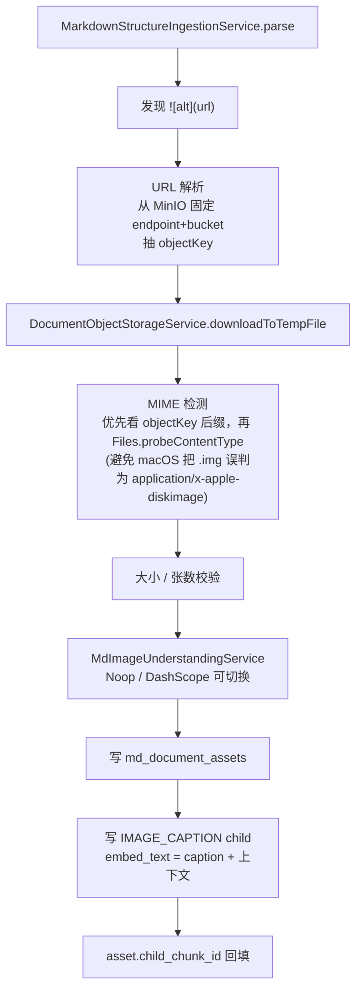

# Markdown 图片 RAG

> 状态：已实现（120 tests / 0 failures）
> 设计文档：`docs/design-md-image-rag.md`
> 实施计划：[.planning/2026-05-27-markdown-image-rag/](#)
> 关联竖井：[[features/markdown-structure-rag]]（结构感知 RAG，本功能在其上叠加图片支持）

## 目标

在 `md-documents` 结构感知 RAG 竖井之上集成图片支持：

- Markdown 图片语法（标准 `` ）按固定 MinIO URL 解析
- 图片同步下载 → 视觉理解（caption）→ 入库为 `IMAGE_CAPTION` 类型 child chunk
- 图片 metadata（含 URL / title）存 `md_document_assets`
- parent 内容包含图片摘要供 parent expansion；检索 citation 携带 `assetUrl` / `assetTitle`

## 关键决策

- **作用域**：仅 `md-documents` 竖井，不涉及任何已退役的标准竖井
- **图片源**：标准 Markdown 图片语法 + 固定 MinIO endpoint+bucket 的完整 URL；**不支持** HTML `` 与代码块内图片
- **同步处理**：图片处理与 markdown 入库同步执行，任一图片失败整篇 import 失败（fail-fast）
- **资产表分离**：新建 `md_document_assets`（迁移 030），**不复用**已退役的 `document_assets`
- **一图一 chunk**：每个图片引用 → 一条 asset + 一条 `IMAGE_CAPTION` child；同文档内同 objectKey 复用视觉理解结果，但 asset / child 各算一条
- **MIME 白名单**：PNG / JPEG / WebP；默认上限 50 张 / 单张 10 MB

## 数据模型

```
md_documents
    │ 1:N
    ▼
md_parent_chunk ──(1:N)──► md_child_chunk ──(N:1)──► md_document_asset
                              │  (含 contentType=IMAGE_CAPTION)
                              │  asset_id ←─── child_chunk_id（双向）
                              ▼
                           md_kb_chunks（Milvus，embed_text 是 caption + 上下文）
```

`md_document_assets.child_chunk_id` 与 `md_child_chunk.asset_id` 形成双向关联。入库流程：

1. 预分配 ID
2. 先插 asset（`child_chunk_id = null`）
3. 再插 child
4. 回填 `asset.child_chunk_id`

## 入库流程



## 两次实测踩坑

1. **macOS MIME 误判**：临时 `.img` 测试文件被识别为 `application/x-apple-diskimage` → MIME 检测改为优先看 objectKey 后缀，再回退 `Files.probeContentType`
2. **尾部 orphan 文本合并**：packing 阶段把尾部 orphan 文本合并回上一段图片切片、抹掉 asset 关联 → packing 阶段对图片切片关闭尾部合并，保持图片 child 独立

## 检索 / Citation 扩展

- `SearchHit` / `Citation` 在原 `assetId` 基础上增加 `assetUrl` / `assetTitle`
- Agentic QA 的 `searchKnowledgeBase` 工具返回结果可携带图片引用
- `readFullSection` 回查 parent 时，parent 正文已含图片摘要（增强后），LLM 可直接引用图片标题与 URL

## 相关页面

- [[features/markdown-structure-rag]] — 父子索引竖井（本功能在其上叠加）
- [[features/markdown-visual-rag-l2]] — 早期图文 RAG 设计（基于已退役的标准竖井，部分理念被本功能吸收）
- [[api/documents]] — md-documents 上传端点
- [[decisions/adr-012-markdown-structure-rag]] — md 结构感知 RAG 决策
