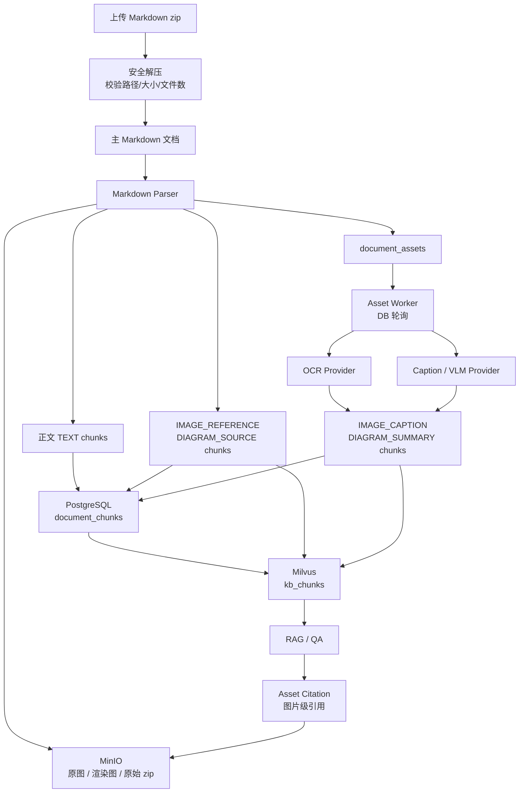

# Markdown 图文 RAG L2 方案

> 状态：设计方案 / 实施计划  
> 关联计划：`.planning/2026-05-23-markdown-visual-rag-l2/`
> 架构决策：[[decisions/adr-011-markdown-visual-rag-l2]]
> 沟通纪要：[[features/markdown-visual-rag-l2-design-notes]]

## 目标

让 Markdown 文档中的正文、图片和流程图都能进入现有 RAG 检索链路，并在问答时支持引用到具体图片或渲染后的流程图。

本方案是 **L2 图文处理**：

- 图片和流程图会被转换成文本说明后进入文本向量检索。
- 不引入图片向量或多模态向量检索。
- 原图和渲染图作为资产存储，用于展示、重跑 OCR/caption、人工修正和引用。

## 总体架构



## 存储分工

| 存储 | 内容 | 说明 |
|------|------|------|
| MinIO | 原始 zip、主 Markdown、图片原件、流程图渲染图、缩略图 | 存二进制资产 |
| PostgreSQL `document_assets` | 图片/流程图资产元数据、状态、OCR、caption、summary、manual override | 视觉资产主数据 |
| PostgreSQL `document_chunks` | 正文 chunk、图片引用 chunk、图片说明 chunk、流程图说明 chunk | RAG 检索投影 |
| Milvus `kb_chunks` | 所有文本 chunk 的 embedding | 仍使用文本向量，不做 L3 多模态向量 |

心智模型：

```text
document_assets = 视觉资产 source of truth
document_chunks + Milvus = 可重建的检索投影
MinIO = 二进制对象存储
```

## 数据模型

### `document_assets`

建议新增表：

| 字段 | 说明 |
|------|------|
| `id` | 资产 UUID |
| `document_id` | 所属文档 |
| `asset_type` | `IMAGE` / `DIAGRAM` |
| `asset_index` | Markdown 中的资产序号 |
| `original_path` | Markdown 中的原始相对路径 |
| `object_key` | MinIO 原图或渲染图 key |
| `thumbnail_object_key` | 缩略图 key，可选 |
| `mime_type` | MIME 类型 |
| `file_size` | 文件大小 |
| `section` | Markdown 标题上下文 |
| `anchor_chunk_index` | 与图片最接近的正文 chunk 位置 |
| `alt_text` | Markdown 图片 alt |
| `title` | Markdown 图片 title 或推断标题 |
| `source_code` | Mermaid / PlantUML 源码 |
| `ocr_text` | OCR 结果 |
| `caption` | 外部模型生成描述 |
| `summary` | 检索摘要 |
| `manual_caption` | 人工修正描述 |
| `manual_summary` | 人工修正摘要 |
| `status` | 资产处理状态 |
| `retry_count` | 重试次数 |
| `next_retry_at` | 下次处理时间 |
| `last_error` | 最近错误 |
| `content_hash` | 后续增量复用预留 |
| `metadata` | JSONB 扩展字段 |

### `document_chunks` 扩展

建议新增字段：

| 字段 | 说明 |
|------|------|
| `content_type` | `TEXT` / `IMAGE_REFERENCE` / `IMAGE_CAPTION` / `DIAGRAM_SOURCE` / `DIAGRAM_SUMMARY` |
| `asset_id` | 关联 `document_assets.id`，正文 chunk 为 null |
| `section` | Markdown 章节 |
| `anchor_chunk_index` | 图文邻近关联用 |

Milvus metadata 同步写入：

```json
{
  "documentId": "...",
  "contentType": "IMAGE_CAPTION",
  "assetId": "...",
  "assetType": "IMAGE",
  "section": "退款流程"
}
```

## 文档状态

新增文档状态：

| 状态 | 含义 |
|------|------|
| `READY_WITH_PENDING_ASSETS` | 正文已可检索，但仍有图片/流程图待处理 |
| `READY_WITH_ASSET_ERRORS` | 正文已可检索，但部分图片/流程图处理失败 |

状态计算规则：

```text
正文摄取失败
  -> FAILED

正文完成，存在 PENDING / PROCESSING / REINDEX_PENDING / REINDEXING
  -> READY_WITH_PENDING_ASSETS

正文完成，所有 asset READY
  -> READY

正文完成，存在 FAILED 且无 pending
  -> READY_WITH_ASSET_ERRORS

正文完成，同时存在 FAILED 和 pending
  -> READY_WITH_PENDING_ASSETS
```

## 资产状态

建议状态：

```text
PENDING
PROCESSING
READY
FAILED
REINDEX_PENDING
REINDEXING
```

处理失败不拖垮正文。缺失图片会生成 `IMAGE_REFERENCE` chunk，并把 asset 标记为 `FAILED`。

## Markdown zip 上传

第一版支持 zip 上传：

- zip 是上传容器，`documents` 记录代表 zip 内唯一主 Markdown。
- zip 中第一版只允许一个主 `.md`。
- 原始 zip 存 MinIO。
- 本地临时解压目录在处理完成后删除。

安全规则：

- 禁止 zip slip：`../`、绝对路径。
- 限制总解压大小。
- 限制文件数量。
- 限制图片数量和单图大小。
- Markdown 图片第一版只支持同目录或子目录下的安全相对路径。
- 禁止绝对路径、远程 URL、base64 data URL。

## 图文处理流程

### Phase 1：资产基础设施

```text
上传 zip
  -> 安全解压
  -> 识别主 Markdown
  -> 解析正文、图片引用、Mermaid/PlantUML
  -> 原图/渲染图存 MinIO
  -> 写 document_assets
  -> 生成 TEXT / IMAGE_REFERENCE / DIAGRAM_SOURCE chunks
  -> 写 document_chunks + Milvus
  -> document.status = READY_WITH_PENDING_ASSETS 或 READY
```

不依赖 OCR/caption 外部模型。

### Phase 2：异步视觉理解

```text
Asset Worker 轮询 PENDING assets
  -> 从 MinIO 读取图片/渲染图
  -> 调 OCR Provider
  -> 调 Caption / VLM Provider
  -> 写 ocr_text / caption / summary / entities
  -> 生成 IMAGE_CAPTION / DIAGRAM_SUMMARY chunks
  -> 写 document_chunks + Milvus
  -> asset.status = READY
  -> 重算 document.status
```

OCR 和 caption 分开配置：

```yaml
enterprise:
  kb:
    visual:
      worker:
        poll-interval-seconds: 30
        batch-size: 10
        max-processing-seconds: 300
      ocr:
        enabled: true
        concurrency: 4
        timeout-seconds: 30
        max-retries: 3
      caption:
        enabled: true
        concurrency: 2
        timeout-seconds: 60
        max-retries: 3
```

### Phase 3：引用与人工修正

```text
RAG 检索命中 IMAGE_CAPTION / DIAGRAM_SUMMARY
  -> citation 返回 assetId / assetType / title / thumbnailUrl / originalUrl
  -> 前端显示“来源：图片/流程图”

用户人工修正 caption/summary
  -> 写 manual_caption / manual_summary
  -> asset.status = REINDEX_PENDING
  -> worker 删除旧 asset chunks/vectors
  -> 生成新 chunks/vectors
  -> asset.status = READY
```

## 检索关联策略

第一版使用：

```text
documentId + section + anchor_chunk_index
```

规则：

- 命中图片/流程图 chunk 时，补充同文档、同章节、anchor 附近的正文 chunk。
- 命中正文 chunk 时，可补充同文档、同章节、anchor 接近的视觉 chunk。
- 多个命中属于同一 `asset_id` 时，引用层合并。
- 优先展示 `IMAGE_CAPTION` / `DIAGRAM_SUMMARY`，回退到 `IMAGE_REFERENCE` / `DIAGRAM_SOURCE`。

未来可升级为显式关系图：

```text
document_chunk_relations
source_type / source_id / relation_type / target_type / target_id
```

## Chunk 文本模板

### 图片引用

```text
[图片引用]
图片标题：{title or alt or filename}
所在章节：{section}
原始路径：{originalPath}
替代文本：{altText}
处理状态：{status}
[/图片引用]
```

### 图片说明

```text
[图片说明]
图片标题：{title or alt or filename}
所在章节：{section}
原始路径：{originalPath}
替代文本：{altText}
OCR文字：{ocrText}
图片描述：{manualCaption or caption}
检索摘要：{manualSummary or summary}
关键实体：{entities}
[/图片说明]
```

### 流程图源码说明

```text
[流程图源码说明]
图标题：{title or section}
图类型：{MERMAID / PLANTUML}
所在章节：{section}
流程关系：{parsedRelations}
源码摘要：{sourceSummary}
[/流程图源码说明]
```

### 流程图说明

```text
[流程图说明]
图标题：{title or section}
图类型：{MERMAID / PLANTUML}
所在章节：{section}
流程关系：{parsedRelations}
OCR文字：{ocrText}
图描述：{manualCaption or caption}
检索摘要：{manualSummary or summary}
[/流程图说明]
```

## API 草案

```text
GET   /api/v1/documents/{documentId}/assets
GET   /api/v1/documents/{documentId}/assets/{assetId}
GET   /api/v1/documents/{documentId}/assets/{assetId}/content
GET   /api/v1/documents/{documentId}/assets/{assetId}/thumbnail
PATCH /api/v1/documents/{documentId}/assets/{assetId}/caption
POST  /api/v1/documents/{documentId}/assets/{assetId}/reprocess
```

授权：

- Asset 复用文档所属 space 的 `VIEWER` 权限。
- 后端校验权限后生成短期 MinIO presigned URL。

## Citation 扩展

建议响应：

```json
{
  "num": 2,
  "chunkId": "...",
  "documentId": "...",
  "documentTitle": "...",
  "excerpt": "该图展示退款流程...",
  "contentType": "IMAGE_CAPTION",
  "asset": {
    "assetId": "...",
    "assetType": "IMAGE",
    "title": "退款流程图",
    "section": "退款流程",
    "thumbnailUrl": "...",
    "originalUrl": "..."
  }
}
```

## 重新摄取

第一版使用全量清理重建：

```text
1. 删除旧 Milvus vectors
2. 删除旧 document_chunks
3. 查询旧 document_assets
4. 删除旧 MinIO objects
5. 删除旧 document_assets
6. 重新解析、上传资产、生成 chunks、写向量
```

`content_hash` 预留给后续增量复用。

## 分期实施

| Phase | 目标 | 验收 |
|-------|------|------|
| Phase 1 | 资产基础设施 | 上传含图片和 Mermaid 的 zip；assets 可见；图片引用和图源码可检索 |
| Phase 2 | 异步视觉理解 | worker 生成 caption/summary chunk；RAG 可回答图片内容；失败状态可见 |
| Phase 3 | 引用与人工修正 | citation 返回 asset；可打开图片；人工修正后重新索引生效 |
| Phase 4 | 验证与评估 | 单测/集成测试覆盖解析、worker、检索、citation、重摄取 |
| Phase 5 | 文档与上线 | 更新操作文档、API 文档、运维说明 |

## 非目标

- 不做 L3 多模态图片向量检索。
- 不做图片区域级引用。
- 第一版不支持远程 URL 图片。
- 第一版不支持 base64 图片。
- 第一版不支持 zip 内多个主 Markdown 文档。

## 关联文件

- 计划文件：`.planning/2026-05-23-markdown-visual-rag-l2/task_plan.md`
- 调研记录：`.planning/2026-05-23-markdown-visual-rag-l2/findings.md`
- 进度记录：`.planning/2026-05-23-markdown-visual-rag-l2/progress.md`
